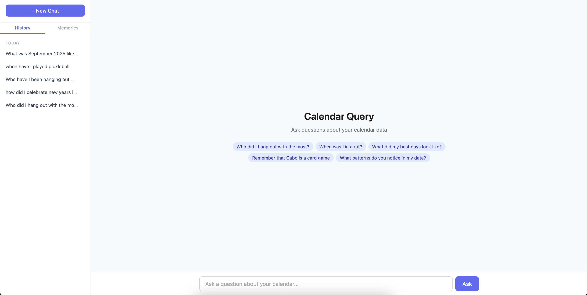

# RTT-Reader

A natural language interface for querying personal calendar data. Ask questions like "Who did I hang out with the most?" or "When was I in a rut?" and get data-backed conversational answers.

Built with a hybrid SQL + vector search backend — structured queries for quantitative questions, semantic search for vibes-based ones.



## The Dataset

I meticulously track every activity in my life as Google Calendar events. The ETL pipeline enriched ~20 months of raw calendar data into a structured, queryable database:

- **8,224 events** from May 2024 to February 2026
- **14,585 sub-activities** decomposed from compound events
- **253 unique people** extracted across 1,846 person-event links
- **17 categories** discovered by the LLM from the data itself (not hand-picked)

### Enriched Fields

| Field | Values |
|-------|--------|
| **Work depth** | deep (930), shallow (635), meeting (532), medium (111) |
| **Mood** | positive (2,768), neutral (1,772), negative (253) |
| **Categories** | commute/transit, routines, social/entertainment, food/dining, deep work, exercise, sleep, and 10 more |
| **Per event** | people, locations, productivity flag, wasted time flag |

## How It Works

```
Google Calendar → data-extract.py → calendar_raw_full.csv
                                          │
                                      etl.py (LLM enrichment + embedding)
                                          │
                              ┌───────────┴───────────┐
                              │                       │
                        calendar.db             calendar_vectors/
                        (SQLite)                (LanceDB)
                              │                       │
                              └───────────┬───────────┘
                                          │
                                       api.py (FastAPI + Claude tool_use)
                                          │
                                   static/index.html (Chat UI)
```

1. **Extract** — Pull all events from Google Calendar via service account
2. **Enrich** — Two-pass LLM pipeline discovers categories from the data, then extracts structured fields (people, locations, mood, work depth, productivity) for every event
3. **Embed** — Sub-activities are embedded into a vector store for semantic search
4. **Query** — Claude picks the right search modality per question (SQL for counts/rankings, vectors for vibes/similarity), iterates with tool calls, and returns grounded answers

## Two Search Modalities

| Modality | Best for | Example |
|----------|----------|---------|
| **SQL** (`run_sql`) | Counts, totals, averages, rankings | "Most productive month", "Top 5 people by time spent" |
| **Semantic** (`semantic_search`) | Vibes, feelings, similarity, patterns | "When was I in a rut?", "Times I was in creative flow" |
| **Both** | Complex questions | Semantic search to find events, then SQL to aggregate stats |

## Setup

### Prerequisites

- Python 3.9+
- Google Calendar with a service account configured for read access
- API keys: Anthropic (Claude), OpenAI (embeddings)

### Installation

```bash
python -m venv venv
source venv/bin/activate
pip install -r requirements.txt
```

### Environment Variables

Create a `.env` file:

```
CALENDAR_ID=your-calendar-id@gmail.com
SERVICE_ACCOUNT_FILE=your-service-account.json
YOUR_TIMEZONE=America/Chicago
ANTHROPIC_API_KEY=sk-ant-...
OPENAI_API_KEY=sk-...
```

### Build the Database

```bash
# 1. Extract events from Google Calendar
python data-extract.py

# 2. Run the ETL pipeline (enrichment + vector store)
#    First run is slow due to LLM calls; subsequent runs are cached
python etl.py
```

### Run the Server

```bash
uvicorn api:app --reload
```

Open [http://localhost:8000](http://localhost:8000) in your browser.

## ETL Pipeline

The enrichment pipeline runs in three passes:

**Pass 1: Category Discovery** — Events are sent to Claude Haiku in batches. The LLM freely tags each event, then a Sonnet call consolidates the top tags into a clean taxonomy. Categories are discovered from the data, not hand-picked.

**Pass 2: Structured Enrichment** — Using the discovered taxonomy, each event is enriched with: sub-activities (compound event decomposition), people, locations, categories, work depth, mood, productivity, and wasted time flags.

**Pass 3: Vector Embedding** — All sub-activities are embedded into LanceDB using OpenAI's `text-embedding-3-small` (1536 dimensions).

The key design decision was **what text to embed**. Three tiers were evaluated:

| Tier | Approach | Problem |
|------|----------|---------|
| Minimal | Just the activity name | Too sparse — "Work" appears 472 times, all embed identically |
| Maximal | Full sentence with exact date, time, duration | Noisy — numeric details dilute semantic signal |
| **Selective prose** | Activity + location + category + sibling context + time band + people + mood | Best of both — rich semantics without noise |

The selective prose approach embeds ~35 tokens per sub-activity. What goes into the embedding text (fuzzy matching) vs. what stays as metadata filters (exact matching):

| Embedded (semantic) | Metadata (filterable) |
|---------------------|----------------------|
| Activity name + location | Exact date, year, month |
| Category label | Exact start hour, duration |
| Sibling context (before/after activities) | event_id |
| Time band (morning/afternoon/evening) | is_productive, is_wasted_time |
| Weekday vs weekend | day_of_week |
| People names, mood, productivity | |

This dual strategy lets a query like "weekday mornings where I was really locked in" combine metadata filters (`day_of_week NOT IN ('Saturday','Sunday') AND start_hour < 12`) with vector similarity to the concept of "locked in."

Both LLM passes use resume-safe JSON caches, so if the process crashes midway it picks up where it left off.

## Memory System

Claude learns about you as you chat. Corrections, terminology, relationships, and preferences are saved to persistent memory and included in future conversations. Memories are browsable and deletable from the sidebar.

## Cost to Build

| Component | Cost |
|-----------|------|
| Claude Code (development) | $34.69 |
| API tokens (ETL + embeddings + per-query) | $16.17 |
| **Total** | **$50.86** |

## Roadmap

- [ ] **Cloud deployment** — Host the app so it's accessible from anywhere, not just localhost
- [ ] **Real-time calendar sync** — Automatically index new/modified/deleted events so the database stays current without manual ETL reruns
- [ ] **Context usage visualization** — Show how much of Claude's context window is being used by the current conversation (system prompt, schema, memories, chat history)

## Project Structure

| File | Purpose |
|------|---------|
| `data-extract.py` | Google Calendar API → CSV extraction |
| `etl.py` | Three-pass LLM enrichment + vector store creation |
| `db.py` | Database helpers, vector search, memory store, Claude tool schemas |
| `api.py` | FastAPI server with Claude tool_use loop |
| `static/index.html` | Single-page chat UI with sidebar |
| `taxonomy.json` | LLM-discovered category taxonomy |
| `test_calendar.py` | Original CLI chatbot (date-range queries) |
| `verify.py` | Quick database verification script |
| `requirements.txt` | Python dependencies |
